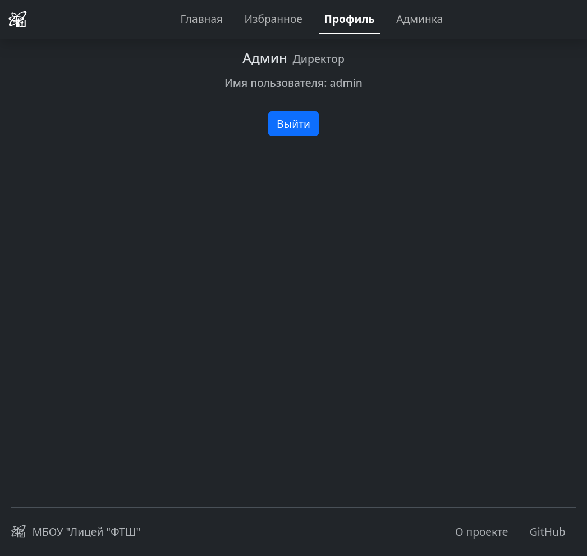
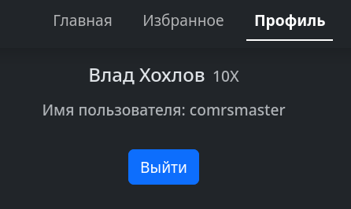
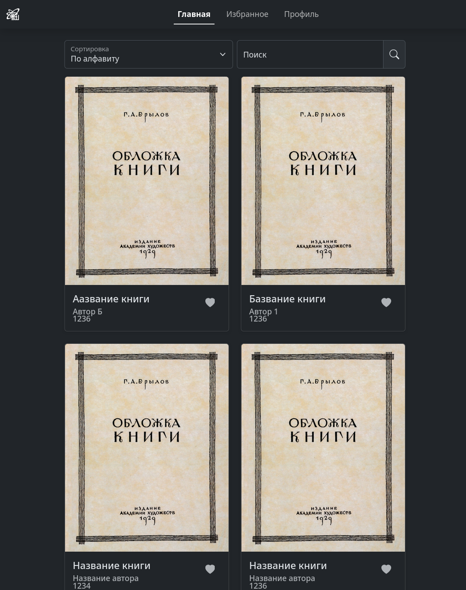
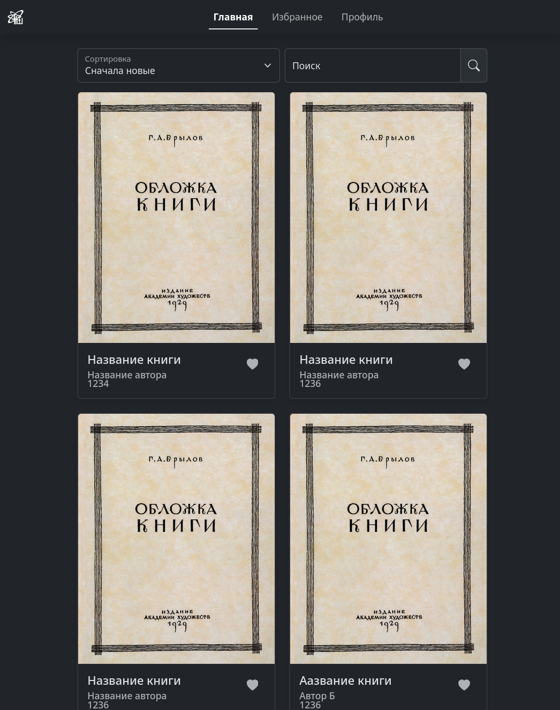
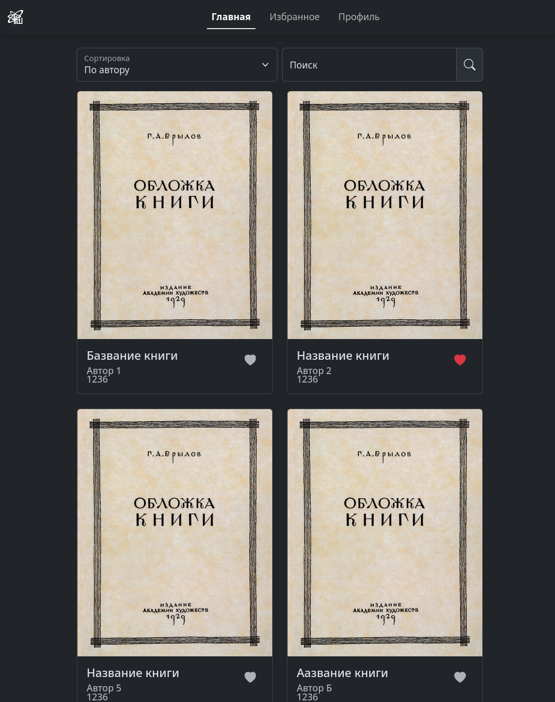
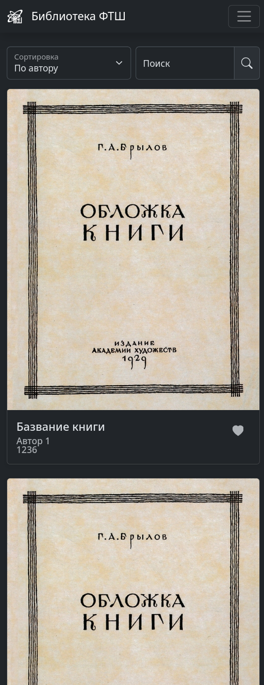

# SchoolLib

#### Это проект электронной библиотеки ФТШ на Python

## Автор:
* Кирилл Муравьёв

Backend написан на Flask. 
Frontend написан без фреймворков, с библиотекой CSS - Bootstrap. 
Для базы данных используется SQLite

## Планируется сделать:
1. [ ] теги для поиска
2. [ ] ограничения для бронирования книг
3. [ ] мобильное приложение
4. [ ] telegram-бот
5. [ ] статистику в профиле
6. [ ] использование домена https://ftshteam.ru (там пока что рикролл)
7. [ ] фото профиля
8. [ ] удаление/изменение/добавление книг/пользователей через админку
9. [ ] сделать поиск по названию книги
10. [ ] сделать админку для библиотекарей

# Скриншоты программы:
У директоров/библиотекарей есть доступ к панели администрации

А у обычных пользователей - нет

Сортировка по алфавиту

Сортировка по времени выхода

Сортировка по автору

Сайт на мобильных устройствах
